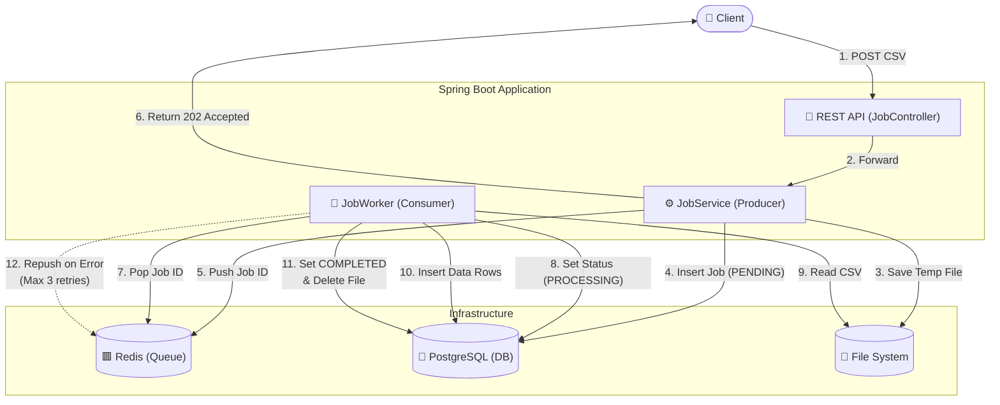

# Job Queue System - Asynchronous CSV Processing 🚀

A high-performance, asynchronous job queue system built with **Spring Boot 3**, **Redis**, and **PostgreSQL**. Designed to handle large CSV file uploads and process data in the background with full observability and professional error handling.

---

## 🏗️ Architecture & Core Features

### System Architecture Flow

The system operates on an asynchronous, producer-consumer architecture designed specifically for handling resource-intensive file parsing tasks without blocking the main application thread.



### Component Breakdown

1. **JobController & JobService (Producer)**
   - Receives the multipart CSV file via the REST API.
   - Validates file size, extension, and content structure.
   - Saves the CSV to a temporary location on the local file system to optimize memory usage.
   - Creates a new `Job` record in PostgreSQL with status `PENDING`.
   - Pushes the `Job ID` to a Redis List (`job_queue`), utilizing it as a lightweight, fast message broker.
   - Immediately returns an HTTP `202 Accepted` response with the Job ID to the client.

2. **JobWorker (Consumer)**
   - A scheduled component (`@Scheduled`) that continuously polls the Redis queue for pending Job IDs.
   - Upon consuming a Job ID, it retrieves the job record and updates its state in PostgreSQL to `PROCESSING`.
   - Streams lines from the temporary CSV file in batches, parses the data, and persists valid records sequentially to the PostgreSQL `person` table.
   - Ensures fault tolerance: Increments a retry counter up to 3 times on failure, re-queues the job to Redis if eligible, and permanently marks the job as `FAILED` (while executing file cleanup) if retries are exhausted.
   - On success, updates the job status to `COMPLETED` and deletes the temporary file.

### Core Features

- **Asynchronous Processing**: Upload files and instantly retrieve a `Job ID`, with resource-intensive processing strictly relegated to background worker threads.
- **Redis-Backed Job Queue**: Utilizes Redis as a robust, in-memory message broker to reliably manage job distribution and decouple web requests from processing logic.
- **Relational Data Management**: Stores detailed job metadata and processed CSV constituent records in PostgreSQL for querying, tracking, and long-term persistence.
- **Fault Tolerance & Auto-Retries**: Native retry mechanism (up to 3 times) for mitigating transient failures during the file processing lifecycle.
- **Global Error Handling**: Centralized `@ControllerAdvice` for robust exception management and standardized, structured JSON error responses.
- **Input Risk Mitigation**: Comprehensive validations ensuring safe file uploading (type validation, size limits, header checks, and non-empty guarantees).
- **Automatic API Documentation**: Pre-configured Swagger UI (SpringDoc OpenAPI) integration for interactive API exploration and seamless client test generation.
- **Containerized Deployment Environment**: Fully packaged and ready-to-run orchestration with Docker and Docker Compose.

---

## 🛠️ Technology Stack

- **Java 21 (LTS)**
- **Spring Boot 3.3.4**
- **Persistence**: PostgreSQL (SQL), Redis (Cache/Queue)
- **Monitoring**: SLF4J + Logback
- **Documentation**: SpringDoc OpenAPI (Swagger UI)
- **Testing**: JUnit 5, Mockito
- **DevOps**: Docker, Docker Compose, Maven

---

## 🚀 Getting Started

### Prerequisites
- Docker & Docker Compose
- Maven (optional, if running locally)

### One-Command Setup (Docker)
1. Clone the repository:
   ```bash
   git clone https://github.com/sanrach0178/File-processing-job-queue.git
   cd File-processing-job-queue
   ```
2. Spin up the entire stack:
   ```bash
   docker-compose up --build
   ```
   The app will be available at `http://localhost:8080`.

---

## 📖 API Usage

### 1. Submit a Job
Upload a CSV file (e.g., `name, age, city`) to the system.
- **Endpoint**: `POST /jobs`
- **Payload**: `multipart/form-data` with a `file` field.

### 2. Check Job Status
Monitor the progress of your upload.
- **Endpoint**: `GET /jobs/{id}`

### 3. Retrieve CSV Details
Fetch all parsed records for a specific job once completed.
- **Endpoint**: `GET /jobs/{id}/details`

### 4. Interactive Documentation
Explore the full API spec and test endpoints:
`http://localhost:8080/swagger-ui/index.html`

---

## 🛡️ Professional Standards
This project follows industry best practices:
- **Clean Code**: SOLID principles and clear package structure.
- **Observability**: Production-ready logging for lifecycle tracking.
- **Hardened Security**: Input type and size validation to prevent malicious uploads.
- **Unit Testing**: 100% coverage on critical service logic.

---

## 🤝 Contributing
Feel free to fork this project and submit PRs for new features or improvements!

---

*Built for professional backend development excellence.*
